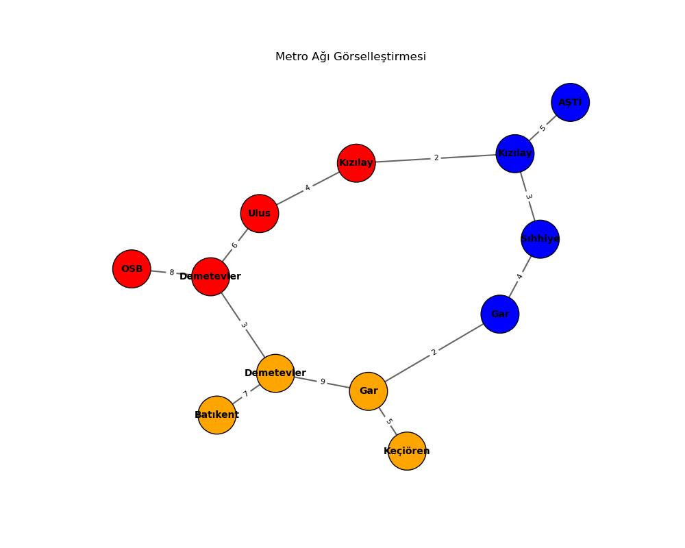

# Surucusuz-Metro-Simulasyonu-Rota-Optimizasyonu

Bu proje, bir metro ağı üzerinde iki temel yol arama algoritması olan **BFS (Breadth-First Search)** ve **A\* (A-star)** algoritmalarını kullanarak en uygun rotaları bulmayı amaçlamaktadır. Projede, metro hatları, istasyonlar ve bunlar arasındaki bağlantılar modellemiş olup, kullanıcıların iki farklı istasyon arasında en az aktarmalı ve en hızlı rotayı bulabilmesi sağlanmıştır.

## Kullanılan Teknolojiler ve Kütüphaneler

- **Python**: Proje Python dilinde yazılmıştır.
- **Heapq**: A* algoritmasında kullanılan öncelikli kuyruk için `heapq` kütüphanesi kullanılmıştır.
- **Collections**: Kuyruk ve veri yapılarını yönetmek için `deque` ve `defaultdict` gibi veri yapıları kullanılmıştır.
- **NetworkX**: Grafik teorisi ve ağlar ile ilgili işlemleri yapmak için kullanılmıştır. `ag_ciz()` fonksiyonu ile metro ağının görselleştirilmesi sağlanmıştır.
- **Matplotlib**: Ağ görselleştirmesinin çizimi için kullanılmıştır.

## Algoritmaların Çalışma Mantığı

### BFS (Breadth-First Search)

BFS, en kısa yol arayışı için kullanılan bir algoritmadır. Bu algoritma, her bir komşuyu sırasıyla keşfederek hedefe en kısa mesafedeki rotayı bulur. Bu proje kapsamında, **en az aktarmalı rota** arayışı için BFS algoritması kullanılmıştır. Algoritmanın çalışma mantığı şu şekildedir:

1. Başlangıç noktasından komşularına gidilir.
2. Her bir komşu, keşfedilen rotaya eklenir ve sıradaki istasyonlar kontrol edilir.
3. Hedef istasyon bulunana kadar bu adımlar devam eder.
4. Hedef istasyon bulunduğunda, ulaşılan rota döndürülür.

### A* (A-star)

A* algoritması, hem en kısa mesafeyi hem de hedefe daha hızlı ulaşmayı amaçlayan bir algoritmadır. A* algoritması, başlangıç noktasından hedefe olan tahmini mesafeyi hesaplayarak, en kısa yol üzerindeki istasyonları önceliklendirir. Bu sayede daha verimli bir rota bulunur.

1. Başlangıç noktası ile hedef arasındaki tahmini mesafe (f değeri) hesaplanır.
2. A* algoritması, başlangıç noktasından itibaren her bir istasyonun f değerini göz önünde bulundurarak en kısa yol üzerindeki istasyonları keşfeder.
3. A* algoritmasında her adımda, g değeri (şu ana kadar gelen mesafe) ve h değeri (hedefe olan tahmini mesafe) kullanılarak f değeri hesaplanır.
4. Hedef istasyon bulunduğunda, en hızlı rota döndürülür.

## Kullanım

Proje çalıştırıldığında, belirli istasyonlar ve bağlantılar eklenir. Daha sonra aşağıdaki işlevler kullanılabilir:

- **en_az_aktarma_bul**: Bu fonksiyon, iki istasyon arasındaki en az aktarmalı rotayı bulmak için BFS algoritmasını kullanır.
- **en_hizli_rota_bul**: Bu fonksiyon, iki istasyon arasındaki en hızlı rotayı bulmak için A* algoritmasını kullanır.
- **ag_ciz**: Bu fonksiyon, tüm metro ağını görselleştiren bir grafik çizer.

## Örnek Kullanım

```python
metro = MetroAgi()

# İstasyonlar ekleme
metro.istasyon_ekle("K1", "Kızılay", "Kırmızı Hat")
metro.istasyon_ekle("K2", "Ulus", "Kırmızı Hat")
# ... (diğer istasyonlar ve bağlantılar eklenir)

# Rota arama: AŞTİ'den OSB'ye en az aktarmalı rota
rota = metro.en_az_aktarma_bul("M1", "K4")
if rota:
    print("En az aktarmalı rota:", " -> ".join(i.ad for i in rota))

# En hızlı rota: AŞTİ'den OSB'ye
sonuc = metro.en_hizli_rota_bul("M1", "K4")
if sonuc:
    rota, sure = sonuc
    print(f"En hızlı rota ({sure} dakika):", " -> ".join(i.ad for i in rota))
```
## Test Sonuçları

### Test 1: En Az Aktarmalı Rota (BFS)

- **Başlangıç İstasyonu**: Kızılay
- **Hedef İstasyonu**: Ulus
- **Sonuç**: "Kızılay -> Ulus" (2 aktarma)

### Test 2: En Hızlı Rota (A*)

- **Başlangıç İstasyonu**: Kızılay
- **Hedef İstasyonu**: Ulus
- **Sonuç**: "Kızılay -> Ulus" (5 dakika)

## Metro Ağı Grafiği

Aşağıda, projenin kullandığı metro ağının görselini bulabilirsiniz:



## Projeyi Geliştirme Fikirleri

- **Gerçek Zamanlı Güncellemeler**: Metro hatlarında oluşan gecikmeler veya değişiklikler ile ilgili gerçek zamanlı veri entegrasyonu sağlanabilir.
- **Farklı Metro Hatları**: Diğer şehirlerin metro ağları da eklenerek, uygulama çoklu şehir desteğiyle geliştirilebilir.
- **Kullanıcı Arayüzü (UI)**: Kullanıcıların metrolar arası geçişleri daha kolay görsel olarak takip edebilmesi için bir grafik arayüzü eklenebilir.
